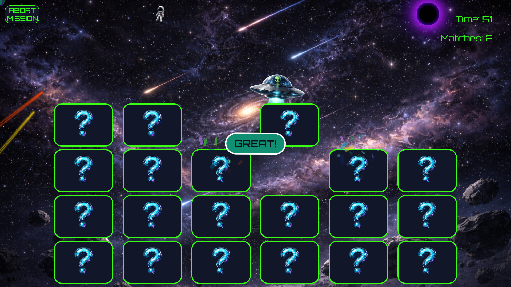

# Planetarium Memory Game

  An interactive browser-based memory game developed during my internship with the P-Tech Planetarium.
  I served as the Project Lead, helping guide the development process while also contributing directly to the design and implementation of the game.

## Project description

  The project was designed as an interactive mini-game for the planetarium experience. Players interact with a memory-based game through a simple interface that can be picked up by anyone from children to seniors.

## Technologies used

  - HTML
  - CSS
  - JavaScript

## My Role

  As the project lead, my responsibilities were:
  - Coordinating project development with team members
  - Organizing team meetings to discuss project guidelines and progress
  - Contributing to frontend design and game functionality
  - Debugging/troubleshooting issues
  - Proper communication throughout development
  - Creating weekly progress reports for our team

## Features

  - Interactive touch screen functionality
  - Responsive user interface
  - Timed gameplay
  - Dynamic game logic using JavaScript
  - User-friendly controls, such as start/exit buttons

## Preview

## What I Learned

  This project strengthened my experience with JavaScript, HTML, and CSS while simultaneously allowing me to work in a collaborative development environment.

  Being the Project Lead helped develop my communication, decision-making, problem-solving, project management, and team leadership skills.

## How to Run the Project

  1. Clone Repository
  2. Open project directory
  3. open main.html in your browser
  4. Enjoy!

## Licensed under MIT license
